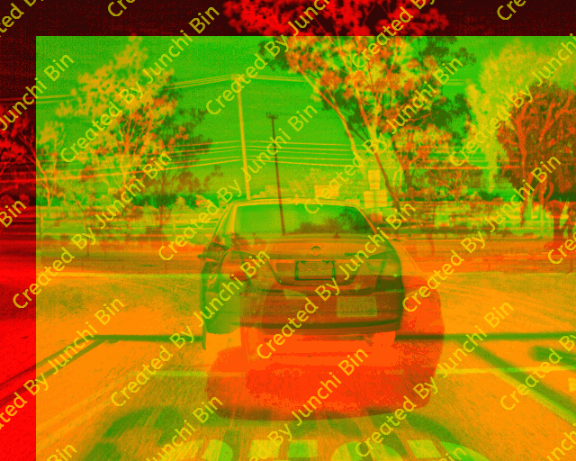
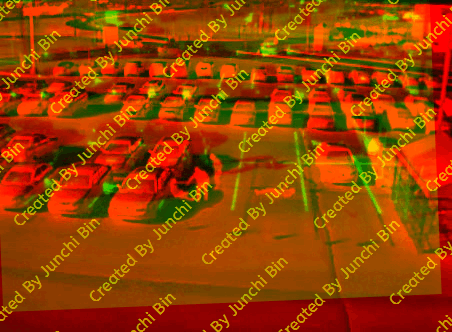
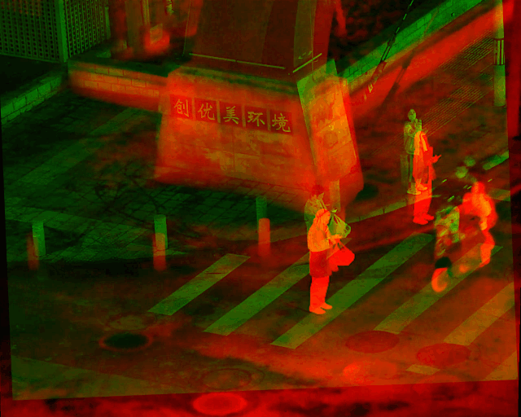
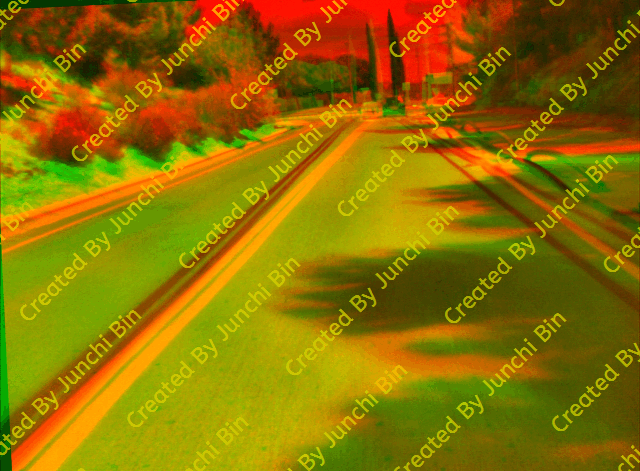
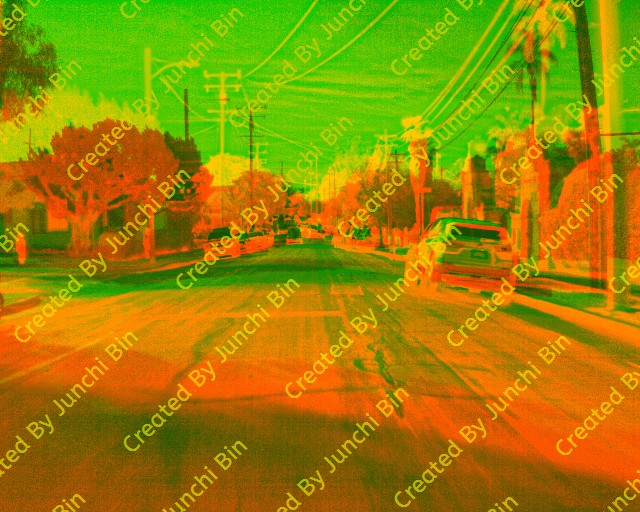
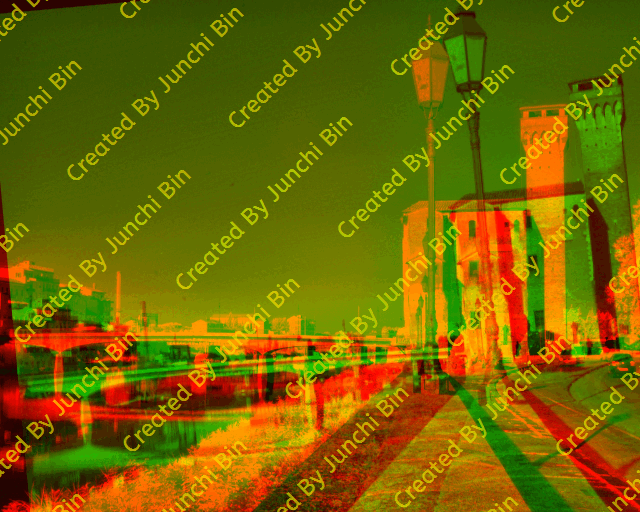
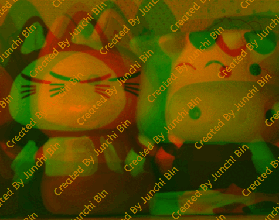
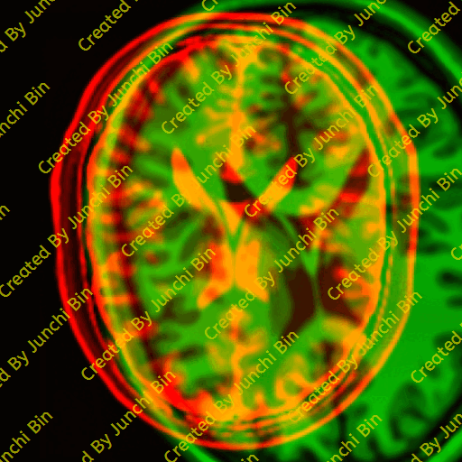
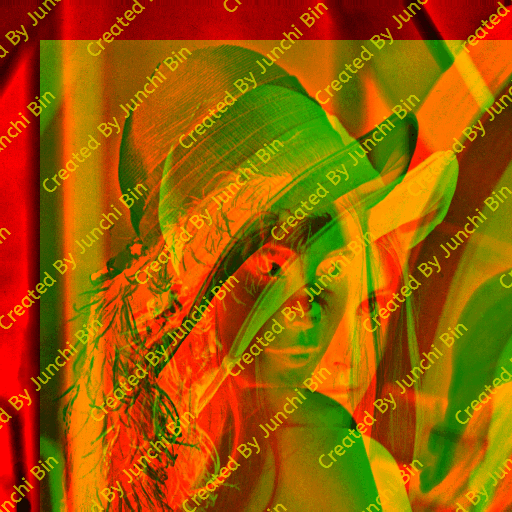

# MOIR
Some animated examples of MOIR as shown below images.
The examples are scratched by some intermediate results during the optimization. 
The source codes may release as original scripts or as an encrypted software in future depending on the confidential requirements.

# Repo Creator

Junchi Bin, MASc

Ph.D. Student at School of Engineering, University of British Columbia, Okanagan Campus

## Visible-Thermal
### Car

### Simulation

<!--  -->

### CVC14

### CVC15

### FLIR

## Other Types
We also try our method on some examples beyond visible and thermal imaging. We may consider to extend the method in future work. 

### NIR

### Multispectral

### Flash

### Medical

### Lenna

