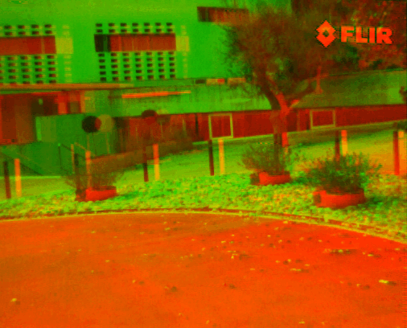

# MOIR
Some rough dynamic examples of MOIR as shown below images. 
The codes may release as an encrypted software in future depending on the confidential requirements from authorities.

This repo is created by

Junchi Bin

School of Engineering, University of British Columbia, Okanagan Campus

## VI-Thermal
### Car

### Simulation

### CVC14

### CVC15

### FLIR

## Other Types
### NIR

### Multispectral

### Flash

### Medical

